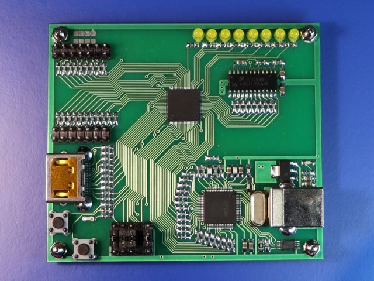

# FPGA плата Marsohod3GW, Gowin

Внимание!
Скорее всего Вас интересует более новая, вторая версия этой платы, а именно Марсоход3GW2.
Пожалуйста перейдите в branch Marsohod3GW2_GW1NR-LV9QN88PC6I5 !

Проект плата Marsohod3GW с чипом FPGA Gowin GW1NR-UV9QN88PC6/I5

Используемая нами микросхема Gowin FPGA имеет встроенные ресурсы:

- до 71 User IO pin
- 8640 LUT
- 6480 FF
- 17280 bit SSRAM
- 468kb BSRAM
- 608Kb User Flash
- 5 DSP Blocks
- 2 PLL
- встроенный генератор OSC
- встроенные блоки сериализаторов OSER/ISER, ELVDS/TLVDS, ODDR/IDDR

Плата Марсоход3GW визуально довольно похожа на платы Марсоход3, она такой же геометрии и основные компоненты расположены так же. Но чип FPGA другой. Что ещё есть на плате?
На плате Марсоход3GW установлены

- двухканальный программатор MBFTDI построенный на чипе FT2232H
- 8ми битная АЦП ADC1175 20MHz
- кварцевый генератор 100МГц
- 2 пользовательские кнопки
- 8 светодиодов
- выход HDMI
- разъем для плат расширения, например, для подключения шилда Ethernet или 7ми сегментного индикатор

В этом репозитории есть ряд отдельных проектов ПЛИС. 
Описание некоторых проектов для платы Марсоход3GW можно найти здесь: https://marsohod.org/projects/marsohod3gw-prj

